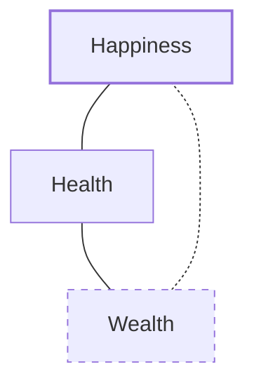

Related sources:  
- [The almanack of Naval Ravikant](https://www.navalmanack.com/)  
- [Algorithms to Live By: The Computer Science of Human Decisions](https://www.amazon.it/Algorithms-live-Brian-Christian/dp/0007547994/ref=tmm_pap_swatch_0)  
- [Joe Rogan Podcast](https://youtu.be/3qHkcs3kG44?si=3b75F9aawTFUsl7G)  
- [Naval Ravikant - How to get rich](https://youtu.be/1-TZqOsVCNM?si=-tMaAm0btKGnon1p)  

# Building Wealth
Hard work matters but it has to be directed in the right direction: know what to do, how to do it and with who.

Wealth is assets that earn while you sleep.

Fortunes require leverage. Business leverage comes from capital, people, and products with no marginal cost of replication (code and media).

Code is the most powerful permissionless leverage.

Set and enforce an aspirational personal hourly rate.

Figure out which things you can provide for society that it does not yet know how to get.

Escape competition by authenticity.

You can only achieve mastery in one or two things. something you're obsessed about and that you can iterate over everyday.

Find the 1% of your discipline that won't be wasted, where you can invest trough all your life, go all-in and leave out the rest.

If you don't own equities in a business, you're chances of making good money is very slim.

Don't look at jobs where input and output are highly connected. That won't create wealth.

Search for, or create, [positive sum wealth games](https://youtu.be/7lSZQix6l3s?si=aAq4sePbesVpjgmp).  
- [YT FEE - wealth isn't zero sum game](https://youtu.be/rixbHbaWBuk?si=IoM8uzldhO7O4eFt)  
- [investopedia game theory](https://www.investopedia.com/terms/g/gametheory.asp)  

Do it for the sake of it, not for money. Id you love money and you make it, that's never enough.

Networking at all costs is bullshit. Do your craft, practice your craft and the Right people will come to you.

Keep doing it. don't keep track. don't count. have a lot of patience.

# Building judgement

https://navalsarchive.substack.com/p/cynicism-is-easy-mimicry-is-easy

wisdom is knowing the long-term consequences of your actions. Wisdom applied to external problems is judgment

the moment of suffering—when you’re in pain—is a moment of truth. It is a moment where you’re forced to embrace reality the way it actually is

To be honest speak wothout identity. Do not self-identify in anything. 

Almost all biases are time-saving heuristics. For important decisions, discard memory and identity, and focus on the problem.

Avoid being dishonest. Once you get used to it you'll start believing your own lies. Your idea of reality will be more and more distant from the truth.

[Praise specifically, criticize generically.]( https://home.workstory.team/post/praise-specifically-criticize-generally#:~:text=Praise%20by%20name%2C%20criticize%20by,the%20art%20of%20giving%20feedback.)

[the more you know the less you diversify. ](https://x.com/NavalismHQ/status/1793875574492139850)

Being successful means being more able to avoid mistakes than being always correct. 
learn the basics very well and practice them everyday looking for a feedback. 

requisites:  
- microeconomics
   - principal-agent problem 
   - compound interest 
- game theory 
- critical thinking 
- complex systems 
- Statistics 

if you can't decide, if you're making a list of pro vs cons, the answer is no.

when you can choose between two similar paths, choose the one more painful in the short term. Look for compound interests gain in the long term.

