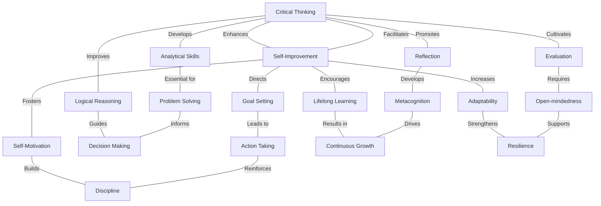

> Template extended from [Mr RIP Doc](https://docs.google.com/document/d/1YvvkZIknNNgLlCdyDcFj5-TENwsR8nvkxYieQxz5b0k/edit#heading=h.hxsiz4z0xvzc)

[Critical Thinking - YouTube](https://www.youtube.com/playlist?list=PLGiSq-ZIghHKMEtScfnUtc9-2pyBgrJcF)
## What
- [Wikipedia](https://en.wikipedia.org/wiki/Critical\_thinking):  
  - “***Critical thinking is the analysis of facts to form a judgment***”  

  - The subject is complex, and **several different definitions exist**, which generally include the **rational**, **sceptical**, **unbiased** analysis, or evaluation of **factual evidence**.  

  - Critical thinking is **self-directed**, **self-disciplined**, **self-monitored**, and **self-corrective thinking**.  
  - It presupposes assent to rigorous standards of excellence and mindful command of their use.  

  - It entails **effective communication** and **problem-solving** abilities as well as a commitment to overcome native **egocentrism** and **sociocentrism**.  

- [The Foundation of Critical Thinking](https://www.criticalthinking.org/pages/defining-critical-thinking/766) (short definition by [Linda Elder](https://www.criticalthinking.org/pages/dr-linda-elder/819), September, 2007\)  

  - Critical thinking is self-guided, self-disciplined thinking which attempts to reason at the highest level of quality in a fair-minded way.  

  - People who think critically consistently attempt to live rationally, reasonably, **empathically**.  

  - They are keenly aware of the **inherently flawed nature of human thinking when left unchecked**.  

  - They strive to diminish the power of their egocentric and sociocentric tendencies.    

  - They use the intellectual tools that critical thinking offers – concepts and principles that enable them to analyze, assess, and improve thinking.  

  - They work diligently to develop the intellectual virtues of intellectual integrity, intellectual humility, intellectual civility, intellectual empathy, intellectual sense of justice and confidence in reason.  

  - They realize that **no matter how skilled they are as thinkers, they can always improve their reasoning abilities** and they will at times fall prey to **mistakes in reasoning**, human irrationality, prejudices, biases, distortions, **uncritically accepted social rules and taboos**, self-interest, and vested interest.  

  - They strive to **improve the world in whatever ways they can and contribute to a more rational, civilized society**. At the same time, they recognize the complexities often inherent in doing so.  

  - They **avoid thinking simplistically about complicated issues** and strive to appropriately consider the rights and needs of relevant others.  

  - They recognize the complexities in developing as thinkers, and commit themselves to **life-long practice toward self-improvement**.  

  - They embody the Socratic principle: “**The unexamined life is not worth living**”, because they realize that many unexamined lives together result in an uncritical, unjust, dangerous world.

  

## Why

Why it is important for the individual  
  - Improve your thinking quality  
  - Improve your arguing skills  
  - Structure your knowledge  
  - Protects you from fake news and propaganda  
  - Better quality of life  

Why it is important for society  
  - Civilized public discussion.  
  - Better Politics.  
  - Totalitarianism (or other \-ism*s*) Prevention.  
  - Peace?

[Why is it so hard to teach](https://www.readingrockets.org/article/critical-thinking-why-it-so-hard-teach)  

  - Obviously it’s not black/white, not a “matter of kind” but “a matter of degree”.  

  - If I had to pick one battle, a single battle, I’d spend my life exposing high school students to Critical Thinking

  
## How

- Migliorare le capacità argomentative: non parlo di persuasione e seduzione ma di logica  

  - Logical fallacies ([wikipedia](https://en.wikipedia.org/wiki/List\_of\_fallacies), [Poster/Cheatsheet](https://thethinkingshop.org/collections/products/products/logical-fallacies-wall-poster), [https://fallacydetected.com/list](https://fallacydetected.com/list) , [logically fallacious](https://www.logicallyfallacious.com/), [Mark Manson](https://markmanson.net/logical-fallacies), [Immanuel Casto](https://www.youtube.com/watch?v=oo5WVtW8m\_U) ([more](https://www.youtube.com/watch?v=qIA7Y0whVSM)), [Visual Capitalist](https://www.visualcapitalist.com/here-are-15-common-data-fallacies-to-avoid/))  

    - Straw Man  

    - [Correlation vs Causation](https://www.tylervigen.com/spurious-correlations), Magical thinking  

    - Ad hominem  

    - Slippery Slope  

    - False Dichotomy  

    - Appeals (authority, probability, pity, tradition, wealth, )  

    - Faulty Generalization  

    - The “Fallacy” Fallacy  

    - [The Fallacy of Gray](https://www.lesswrong.com/posts/dLJv2CoRCgeC2mPgj/the-fallacy-of-gray)  

  - How to disagree ([paul graham](http://www.paulgraham.com/disagree.html))  

  - Steelman ([Peterson vs Harris](https://www.youtube.com/watch?v=Uh-DKbKlfag), [Farnam Street](https://fs.blog/2020/05/bad-arguments/))  

  - Rationality ([read the sequences](https://www.readthesequences.com/), [12 virtues](https://www.lesswrong.com/posts/7ZqGiPHTpiDMwqMN2/twelve-virtues-of-rationality), [checklist](https://www.rationality.org/resources/rationality-checklist))  

  - “*It is better to debate a question without settling it than to settle a question without debating it.*” — Joseph Joubert  

- Costruire la propria Knowledge Base  

  - Skepticism / Data Driven / Evidences ([Critical Thinking Cheatsheet](https://lenscleaner.files.wordpress.com/2017/01/picture.png)) / Uncertainty ([Socrates](https://moretothat.com/socrates/))  

  - Why?  

    - [Literacy](https://blas.com/the-gervais-principle/) (“*Literacy of any sort gives you the power to recognize and unambiguously label things that the illiterate can easily ignore as noise, fads and bullshit*”)  

    - [Wisdom](http://paulgraham.com/wisdom.html)  

  - Input selection ([The Garden and the Stream](https://hapgood.us/2015/10/17/the-garden-and-the-stream-a-technopastoral/), [The Holiday Paradox](https://www.youtube.com/watch?v=zHL9GP\_B30E\&t=160s), [The TV Paradox](https://www.youtube.com/watch?v=zHL9GP\_B30E\&t=1651s))  

    - Intentionality, Quantity, Kind (audio, video, written), Quality, Diversity, Always Evolving  

    - Curate what you’re exposed to. [Avoid junk](https://fs.blog/2020/01/spot-bad-science/), learn how to [navigate digital information](https://www.youtube.com/watch?v=L4aNmdL3Hr0\&list=PL8dPuuaLjXtN07XYqqWSKpPrtNDiCHTzU), but also avoid Echo chambers.  

    - Tools: RSS (feedly), Subscriptions, read/watch later, bookmarks, long form, depth, commitment to consume some input every day..  

  ### Mental Models ([Farnam Street](https://fs.blog/mental-models/))  

    - [The Map is not the Territory](https://fs.blog/2015/11/map-and-territory/)  

    - [Circle of Competence](https://fs.blog/2013/12/circle-of-competence/)  

    - [First Principle Thinking](https://fs.blog/2018/04/first-principles/) (Wait But Why: [the cook and the chef](https://waitbutwhy.com/2015/11/the-cook-and-the-chef-musks-secret-sauce.html))  

    - [Second Order Thinking](https://fs.blog/2016/04/second-order-thinking/) (Nat Eliason’s [Level 3 Thinking](https://www.nateliason.com/blog/level-3-thinking))  

      - Against “Short Termism”  

      - Ask yourself ”And then what?”  

    - Worst Case scenario  

    - [Thought Experiments](https://fs.blog/2017/06/thought-experiment/)  

      - [https://fs.blog/thought-experiment/](https://fs.blog/thought-experiment/)  

    - [Inversion](https://fs.blog/2013/10/inversion/)  

    - [Occam Razor](https://fs.blog/2019/10/occams-razor/)  

    - Black Swan / Antifragility  

  - Bayesian integration / Probabilistic Thinking / Learning / Knowledge Retention  

    - [Arbital Bayes Rule](https://arbital.com/p/bayes\_rule/?l=1zq)  

    - More to That’s [Information Lifecycle](https://moretothat.com/information-lifecycle/)  

    - [Probabilistic Thinking](https://fs.blog/2018/05/probabilistic-thinking/)  

    - Thinking in Bets ([Talk at Google](https://www.youtube.com/watch?v=uYNsSeYjkp4), [Rational Reminder](https://www.youtube.com/watch?v=ZU2VOXH2PI4))  

    - Learning how to Learn ([coursera](https://www.coursera.org/learn/learning-how-to-learn), [Scott Young](https://www.scotthyoung.com/blog/2019/02/15/memory/))  

    - Listening ([Active Listening](https://fs.blog/2017/07/active-listening/), [Resonance](https://fs.blog/2019/05/resonance-open-doors/))  

    - Asking Questions ([Farnam Street](https://fs.blog/2019/09/power-questions/))  

    - Bloom Taxonomy ([wikipedia](https://en.wikipedia.org/wiki/Bloom's\_taxonomy), [image](https://www.interactive-maths.com/uploads/1/1/3/4/11345755/974763677\_orig.jpg), [teachthought](https://www.teachthought.com/tag/blooms-taxonomy/))  

  - Cognitive Biases  

    - [this is water](https://fs.blog/2012/04/david-foster-wallace-this-is-water/) \- [transcript](https://fs.blog/2012/04/david-foster-wallace-this-is-water/)  

    - [Immanuel Casto](https://www.youtube.com/watch?v=8iiKv4sEaxU)  

    - [Wikipedia](https://en.wikipedia.org/wiki/List\_of\_cognitive\_biases), [RationalWiki](https://rationalwiki.org/wiki/List\_of\_cognitive\_biases),  

    - [Visual Capitalist infographic](https://www.visualcapitalist.com/50-cognitive-biases-in-the-modern-world/) (very good)  

    - Charlie Munger’s [Psychology of Human Misjudgement](https://fs.blog/great-talks/psychology-human-misjudgment/) ([video](https://www.youtube.com/watch?v=pqzcCfUglws))  

    - Kevin Simler’s [Crony Belief](https://meltingasphalt.com/crony-beliefs/) (also: [The Elephant in the Brain](https://meltingasphalt.com/the-elephant-in-the-brain/) \- [video](https://www.youtube.com/watch?v=V84\_F1QWdeU))  

    - Dan Ariely [TED Talks](https://www.ted.com/speakers/dan\_ariely?language=en)  

    - Daniel Kahneman’s [Thinking Fast and Slow](https://en.wikipedia.org/wiki/Thinking,\_Fast\_and\_Slow)  

    - [The Cognitive Bias Codex](https://upload.wikimedia.org/wikipedia/commons/6/65/Cognitive\_bias\_codex\_en.svg) (awesome)  

  - Cognitive Biases examples  

    - [Loss Aversion](https://en.wikipedia.org/wiki/Loss\_aversion)  

    - [Availability](https://en.wikipedia.org/wiki/Availability\_heuristic)  

    - [Blind Spot](https://en.wikipedia.org/wiki/Bias\_blind\_spot) and [Cognitive Dissonance](https://en.wikipedia.org/wiki/Cognitive\_dissonance)  

    - [Confirmation](https://en.wikipedia.org/wiki/Confirmation\_bias) (cherry picking)  

    - [Survivorship](https://en.wikipedia.org/wiki/Survivorship\_bias) ([xkcd](https://xkcd.com/1827/))  

    - [Anchoring](https://en.wikipedia.org/wiki/Anchoring\_(cognitive\_bias))  

    - [Arrival Fallacy](https://www.thesimpledollar.com/financial-wellness/financial-goals-and-the-arrival-fallacy/) ([more](https://www.nytimes.com/2019/05/28/smarter-living/you-accomplished-something-great-so-now-what.html))  

    - Dunning-Kruger and Impostor Syndrome  

  - Exploration: Curiosity  

    - Umberto Eco’s Antilibrary  

    - Vsauce’s [TED Talk](https://www.youtube.com/watch?v=u9hauSrihYQ)  

    - Feynman’s [Why](https://www.youtube.com/watch?v=36GT2zI8lVA)  

    - Mercadini: [Come Imparo Le Cose](https://www.youtube.com/watch?v=5wUbCWQg5C8) e [Il Paradosso Della Scuola](https://www.youtube.com/watch?v=WCIqU3W5ALY)  

  - Exploitation: Practice & Depth  

    - Deliberate Practice (Cal Newport’s [99u Talk](https://www.youtube.com/watch?v=IIMu1PGbG-0), [So Good They Can’t Ignore You](https://www.youtube.com/watch?v=qwOdU02SE0w), [Deep Work](https://www.youtube.com/watch?v=rrIYNRuX6GM) \- [more](https://lexfridman.com/cal-newport/), [Farnam Street: deliberate practice](https://fs.blog/2021/04/deliberate-practice-guide/))  

    - Iterations ([Jason Fried](https://m.signalvnoise.com/teaching-iteration/))  

    - Find the right mix of Exploration vs Exploitation.  

  - Research: how to search for information in an abundant world. Googling is a skill\!  

  - Knowledge Retention and Organization:  

    - PKM (Commonplace Book, Ryan Holiday’s “Notecard System”, Luhman’s Zettelkasten, Derek Sivers’ “Thoughts On”)  

    - How to Read  

    - How to take notes (Progressive summarization)  

    - Building a Second Brain  

  - Having Opinions ([The work required to have an opinion](https://fs.blog/2013/04/the-work-required-to-have-an-opinion/))  

- Output  

  - Create\! (More to That’s [Release Ratio](https://moretothat.com/release-ratio/), Altucher’s [Idea Machine](https://jamesaltucher.com/blog/the-ultimate-guide-for-becoming-an-idea-machine/), Altucher’s [Idea Sex](https://jamesaltucher.com/blog/how-to-make-millions-with-idea-sex/))  

  - Write\! ([paul graham](http://www.paulgraham.com/essay.html), [jordan peterson](https://www.youtube.com/watch?v=bfDOoADCfkg) ([more](https://www.youtube.com/watch?v=JgbLIUk7S2U), [more](https://www.youtube.com/watch?v=Kwjw2J6ByJo)), [Perell](https://perell.com/essay/writing/) ([more](https://perell.com/essay/the-ultimate-guide-to-writing-online/)), [more to that](https://moretothat.com/economics-of-writing/))  

    - Note: not talking about persuasion, manipulation, copywriting.. Even though knowing those “weapons” can make you a better writer, thinker, debater.  

  - Learn by Teaching ([Feynman Technique](https://fs.blog/2021/02/feynman-learning-technique/))  

  - Decision Making…  

  - Planning… TimeBlocking  

  - Productivity… GTD, PARA  

  - Measuring… Time Tracking  

  - Attention Economy / Digital Minimalism…

