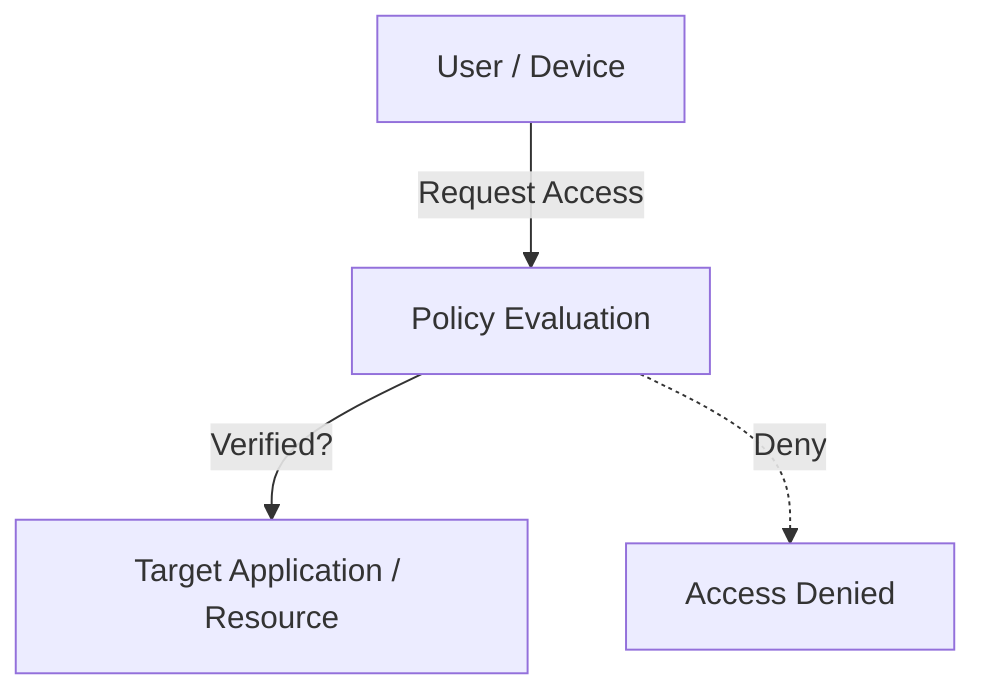
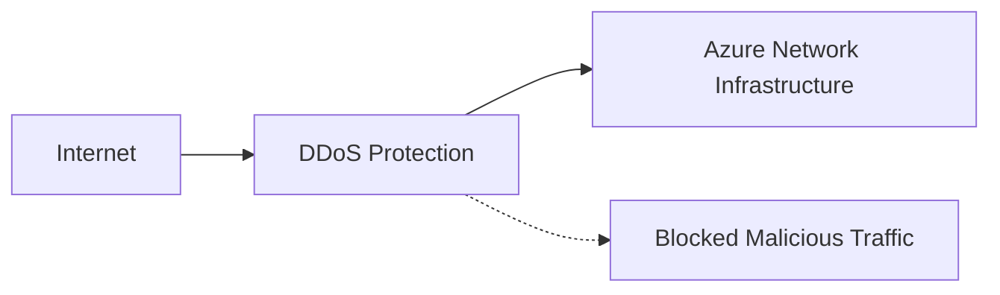
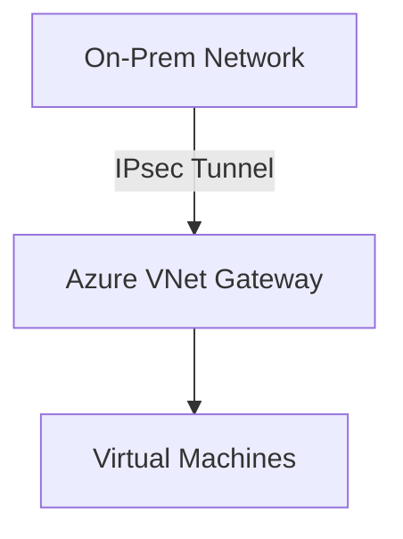
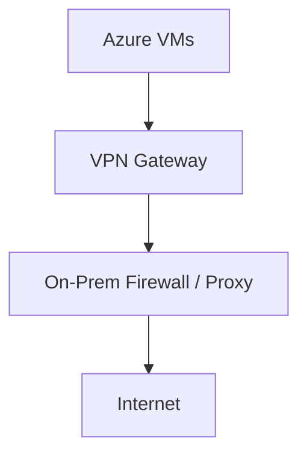

AZ-500
-----

- [AZ-500 Microsoft Azure Security Technologies Study Cram](https://www.youtube.com/watch?v=6vISzj-z8k4&t=187s&ab_channel=JohnSavill%27sTechnicalTraining) +3h
- [Microsoft Certified: Azure Security Engineer Associate - Certifications | Microsoft Learn](https://learn.microsoft.com/en-us/credentials/certifications/azure-security-engineer/?practice-assessment-type=certification)
- [Top Five Security Tips (youtube.com)](https://www.youtube.com/watch?v=JYWR5GoF3vM&ab_channel=JohnSavill%27sTechnicalTraining)
- [Microsoft Azure Security Engineer Associate (AZ-500) Professional Certificate | Coursera](https://www.coursera.org/professional-certificates/microsoft-azure-security-engineer-associate) ~ 101h
- [Practice Assessment | Microsoft Learn](https://learn.microsoft.com/en-us/credentials/certifications/azure-security-engineer/practice/assessment?assessment-type=practice&assessmentId=57&practice-assessment-type=certification)
- [Exam Readiness Zone | Microsoft Learn](https://learn.microsoft.com/en-us/shows/exam-readiness-zone/?products=azure&terms=az-500)
- https://www.examtopics.com/exams/microsoft/az-500/view/
- https://learn.microsoft.com/en-us/azure/well-architected/security/

-----

# Licenses

|                                                                                                                 |     |     |             |
| --------------------------------------------------------------------------------------------------------------- | --- | --- | ----------- |
| [EntraID features](https://www.microsoft.com/en-us/security/business/microsoft-entra-pricing)                   | P1  | P2  | Entra Suite |
| Portal                                                                                                          | X   | X   |             |
| RBAC                                                                                                            | X   | X   |             |
| [Conditional Access](https://learn.microsoft.com/en-us/entra/identity/conditional-access/overview)              | X   | X   |             |
| [Password Protection](https://learn.microsoft.com/en-us/entra/identity/authentication/concept-password-ban-bad) | X   | X   |             |
| Cross-tenant user sync                                                                                          | X   | X   |             |
| Group management                                                                                                | X   | X   |             |
| Session lifetime management                                                                                     | X   | X   |             |
| SharePoint limited access                                                                                       | X   | X   |             |
| Reports                                                                                                         | X   | X   |             |
| PROTECTION                                                                                                      |     |     |             |
| Risk-based conditional access                                                                                   | X   | X   |             |
| Device filtering conditional access                                                                             | X   | X   |             |
| Real-time sign-in assessment                                                                                    | X   | X   |             |
| Real-time user assessment                                                                                       | X   | X   |             |
| Authentication context                                                                                          | X   | X   |             |
| Risk event investigation                                                                                        | X   | X   |             |
| Token protection                                                                                                | X   | X   |             |
| GOVERNANCE                                                                                                      |     |     |             |
| Automated user provisioning   to cloud and on-prem apps                                                      | X   | X   | X           |
| HR-driven provisioning                                                                                          | X   | X   | X           |
| Terms-of-use attestation                                                                                        | X   | X   | X           |
| Basic entitlement management                                                                                    |     | X   | X           |
| Privileged Identity management (PIM)                                                                            |     | X   | X           |
| VERIFIED ID                                                                                                     |     |     |             |
| Verifiable credentials issuance   and verification                                                           | X   | X   | X           |
| INTERNET ACCESS                                                                                                 |     |     | X           |
| PRIVATE ACCESS                                                                                                  |     |     | X           |

[Explore the Microsoft identity platform - Training | Microsoft Learn](https://learn.microsoft.com/en-us/training/modules/explore-microsoft-identity-platform/?WT.mc_id=m365-16105-cxa)

# ENTRA ID
## AUTHN

Components:

Portal, Oauth2, OIDC, MSGraph APIs, open source libraries (MSAL)…

### Service Principals

An application registered in EntraID gets a global unique object ID and a service principal.

The app can be single tenant or multi-tenant.

Object ID: scoped across the home tenant. It is like a class with static properties used as template to create the app instances through service principals.

It defines mainly:

- How to issue tokens
- Resources available
- Actions permitted

Service principal: An app registration will create a SP, with specific permissions (eg: delegated).

- Application: App Instance = SP single tenant representation of a global object ID.
- [Managed Identity](https://learn.microsoft.com/en-us/entra/identity/managed-identities-azure-resources/overview): for services supporting EntraID authn. Can have permissions updates but not direct edits.
    No need to manage certificates in the app.

- System assigned: 1 identity <--> 1 managed SP
    If you require that each resource has its own identity, or have resources that require a unique set of permissions and want the identity to be deleted as the resource is deleted, then you should use a system-assigned identity.
- User assigned:     N to N map to resources
    User-assigned identities can be used by multiple resources, and their life cycles are decoupled from the resources’ life cycles with which they’re associated.

[Best practice recommendations for managed system identities - Managed identities for Azure resources | Microsoft Learn](https://learn.microsoft.com/en-us/entra/identity/managed-identities-azure-resources/managed-identity-best-practice-recommendations)

- Legacy

You can login directly against the cloud IdP or to a [Passthrough authentication](https://learn.microsoft.com/en-us/entra/identity/hybrid/connect/how-to-connect-pta-quick-start) agent.
With Pass-through Authentication, the user’s password is validated against the on-premises Active Directory, ensuring a secure and seamless authentication experience.

AADS/[Entra Domain Services](https://learn.microsoft.com/en-us/entra/identity/domain-services/overview) creates managed Domain Controllers in another VNet to sync the authentication of users coming from another IdP. It is only synced from the Main DC to the managed replicas direction.

## SSO

## [Kerberos](https://youtu.be/5N242XcKAsM?si=hpCSADRauVUlo7Hy)
- [Kerberos Authentication Overview | Microsoft Learn](https://learn.microsoft.com/en-us/windows-server/security/kerberos/kerberos-authentication-overview)
![[kerberos-authentication-illustration.jpg]]
1. KDC = Key Distribution Center
2. If client credentials are valid, the KDC emits a Ticket Granting Ticket (TGT).
3. Before accessing a specific service, the client sends the TGT back to the KDC to receive a new ticket scoped for the target service.
4. Until this new ticket expires, the client can access the target server without repeating the authentication process.

Cons:
- [pass-the-ticket attack](https://attack.mitre.org/techniques/T1550/003/)
- [Kerberoasting](https://attack.mitre.org/techniques/T1558/003/)
- Missing sync between servers' clocks

## Guest Users

Authentication happens against their IdP (social network, external AD, mail...) while authorization happens against our service (OAuth2).

## EntraAD B2B
Guest users could be:
- from an external Azure AD tenant
- from an external Microsoft account
- synced from an on-prem Domain Controller
- guest users created on the EntraID host tenant
## EntraAD B2C

## Conditional Access:

Apply policies to target

- users (external, groups, roles)
- Actions (registration...)
- Apps
- Platforms
- Locations

To require:

- [MFA](https://learn.microsoft.com/en-us/entra/identity/authentication/concept-mfa-howitworks)
  [MFA settings](https://learn.microsoft.com/en-us/entra/identity/authentication/howto-mfa-mfasettings)
    Number matching prevents accidental approval by requiring the user to type in a two-digit code from the login screen to their Authenticator app.

    [OATH TOTP](https://learn.microsoft.com/en-us/entra/identity/authentication/concept-authentication-oath-tokens) tokens: users can have a max of 5 between hardware based tokens and authentication apps.

- something you **know** (psw)
- Smt you **have** (usb key, mobile app...)
- Smt you **are** (fingerprint)

- Allow only enrolled devices
- IP filtering (named locations)
- VPN
- certificate based auth
- [passkeys (FIDO2)](https://learn.microsoft.com/en-us/entra/identity/authentication/how-to-enable-passkey-fido2)
  an MFA setup might include:
	1. **Something You Have**: A FIDO2 security key or a mobile device with FIDO2 capabilities.
	2. **Something You Are**: Biometric verification like a fingerprint or facial recognition.
	3. **Something You Know**: A password or PIN.

To then report [risky users and accesses](https://learn.microsoft.com/en-us/entra/id-protection/concept-identity-protection-risks#risk-detections-mapped-to-riskeventtype) (malicious IP, psw spray, anonymous IP...)

# AUTHZ

## OAuth2

is an authz method where third party apps can get authorized on behalf of a user to web hosted resources (MSGraph, Az Key Vaults...) by exchanging [tokens](https://learn.microsoft.com/en-us/entra/identity-platform/v2-protocols#tokens) provided by the IdP.

The [tokens](https://learn.microsoft.com/en-us/entra/identity-platform/v2-protocols#tokens) are given by Az Identity and validated by MSGraph API.

[Explore Microsoft Graph - Training | Microsoft Learn](https://learn.microsoft.com/en-us/training/modules/microsoft-graph/)

[Microsoft Graph Fundamentals - Training | Microsoft Learn](https://learn.microsoft.com/en-gb/training/paths/m365-msgraph-fundamentals/)

Tokens can be
- ID tokens
- Access tokens: are sent in the http req as bearer tokens in the Authorization header
- Refresh tokens

In OAuth2 permissions are called **scopes**.
- [OAuth 2.0 and OpenID Connect protocols on the Microsoft identity platform - Microsoft identity platform | Microsoft Learn](https://learn.microsoft.com/en-us/entra/identity-platform/v2-protocols)
- [Microsoft identity platform token exchange scenario with SAML and OIDC/OAuth in Microsoft Entra ID - Microsoft identity platform | Microsoft Learn](https://learn.microsoft.com/en-us/entra/identity-platform/scenario-token-exchange-saml-oauth)
- [MSAL](https://learn.microsoft.com/en-us/entra/identity-platform/msal-overview)

- [Golang Azure MSAL](https://github.com/AzureAD/microsoft-authentication-library-for-go)

Permissions can be:

- Delegated: a user must be present to sign-in
- App-only: background services apps (daemons)

Consent type:

- Static: need to know all the resources in advance
- Dynamic: you can increment the scope access over time
- Admin

# User management
## [Administrative Units](https://learn.microsoft.com/en-gb/entra/identity/role-based-access-control/administrative-units)

Administrative units restrict permissions in a role to any portion of your organization that you define (geographical, business unit...), if you assign a role to a user that is not a member of an administrative unit, the scope of the role is the entire tenant.

You can assign the user to an administrative unit, group, or Microsoft Entra role when the account is created. You can assign the user to up to 20 groups or roles.

A.U. can't be nested.
[Entra ID Governance](https://learn.microsoft.com/en-us/entra/id-governance/identity-governance-overview) can't manage A.U.

## Users

Global Admins and Auth Admins can create and delete users (also admin), B2B users and B2C users.
[User Administrator](https://learn.microsoft.com/en-us/entra/identity/role-based-access-control/permissions-reference#user-administrator) can't delete other admins.
Deleted users are soft deleted for 30 days.

**Licenses**: depending on user location there should be available Free, P1 and P2 licenses. Licenses could be also assigned to a group and inherited by their users, a user has to be removed from the group to have his license retired. If the user is instead synced from an on-premise AD it will be soft deleted.

External Identities

B2B collaboration is a feature within Microsoft Entra External ID that lets you invite guest users to collaborate with your organization.

The partner uses their own identity management solution, so there's no external administrative overhead for your organization.

## Groups

Members can include: users, service principals, groups, devices.

Options:

- AD Roles can be assigned
- Membership:

- Assigned
- Dynamic users membership (query rules)
- Dynamic device

- Name, Description
- Owners

Microsoft 365 Groups: share access to calendar, Teams channels, SharePoint sites...

## Roles

RBAC can give specific permissions to some user or group to a given scope like a management group, a resource group, a resource or an entire subscription.

Policies

- Tracking compliance
- Offers remediations
- Track Events

### Global Administrator
Suggested to have less than 5. Can revoke MFA and edit all other roles.

## Resources

Subscription > Management group > resource group > resource > resource internal scope.

Can be locked.

I can deploy a template of resources through a BLUEPRINT.

### PIM (Privileged Identity Management)

Give the roles just in time for a limited amount of time.

# Hybrid Cloud
- [psw hash sync](https://learn.microsoft.com/en-us/entra/identity/hybrid/connect/whatis-phs)
- Passthrough auth: needs agents installation
- Federation
[Hybrid cloud authn decision tree](https://learn.microsoft.com/en-us/entra/identity/hybrid/connect/choose-ad-authn#decision-tree)

### [Azure Connect](https://learn.microsoft.com/en-us/entra/identity/hybrid/connect/whatis-azure-ad-connect)
On-prem application to sync AD accounts to the cloud.

Filtering on identities to sync (computers, users, groups..)
[psw hash sync](https://learn.microsoft.com/en-us/entra/identity/hybrid/connect/whatis-phs): uses on-prem AD as authentication authority
Psw writeback: reset your psw in the cloud conditioned by on-prem policies
Federation features

Psw policy doesn't apply to synchronized accounts from on-prem using Connect.
[Implement password hash synchronization with Microsoft Entra Connect Sync - Microsoft Entra ID | Microsoft Learn](https://learn.microsoft.com/en-us/entra/identity/hybrid/connect/how-to-connect-password-hash-synchronization#password-policy-considerations)

### [Entra Cloud Sync](https://learn.microsoft.com/en-us/entra/identity/hybrid/cloud-sync/what-is-cloud-sync)
Cloud architecture: one or more agents installed in on-prem apps while the configuration is kept in the cloud, no need to connect AD forests to network. No need to manage upgrades.

### [Entra Domain Service](https://learn.microsoft.com/en-us/entra/identity/domain-services/overview)
Two Windows domain controller server are deployed in the Azure cloud to create a new domain connected to the legacy AD.
The synch is one-way from the legacy on-prem and EntraID to the cloud managed replica.
HA through multiple DC replicas.
It is useful for giving access to legacy on-prem apps (LDAP, NTLM, Kerberos) through SSO and to give those accounts a fine grained policy protection.

If [an account is locked out]([Create and use password policies in Microsoft Entra Domain Services - Microsoft Entra ID | Microsoft Learn](https://learn.microsoft.com/en-us/entra/identity/domain-services/password-policy)) in EntraDS it is not locked out in tits original source directory (EntraID or on-prem).

**NTLM**
- requires an application server to connect to a domain controller to authenticate every client computer or service.
- NTLM does not enable clients to verify a server's identity or enable one server to verify the identity of another. NTLM authentication was designed for a network environment in which servers were assumed to be genuine. The Kerberos protocol makes no such assumption.

- LDAP

# [IDENTITY PROTECTION](https://learn.microsoft.com/en-us/entra/id-protection/overview-identity-protection)
Tool to identify and remediate suspicious login activities
- password policies
- geospatial login checks
- MFA
- Suspicious behaviour detection
- self-remediation workflows

Sign-in (suggested at medium level) and user risks (suggested at high level) can be remediated.
- self-remediation workflow
- reset password when SSPR is impossible
	- user admin can't reset psw in case of an incident
- dismiss risk
- close detection
Depending on the risk the user can be **unblocked** by resetting their psw or logging in from a known location.

**Smart lockout**:
- by default 10 different failed attempts are allowed on public cloud
- customizations require P1 license
- Use much higher thresholds for on-prem lockout polices
- even admins can't unlock a lockout user

## Risk Event Detection

[**Risk policies**]([Risk policies - Microsoft Entra ID Protection | Microsoft Learn](https://learn.microsoft.com/en-us/entra/id-protection/howto-identity-protection-configure-risk-policies)) can be at low, medium or high level for:

- **User** (legacy): related to identity risks as leaked credentials or anomalous activity.
- **Sign-in** (legacy):
  if a member of the target user group has a risk detected during sign-in, a remediation policy could be automatically triggered like asking for MFA.
  Detects impossible travel, malware or anonymous IPs...
- **MFA registration**: can be used in combination of both user and sign-in risk policy
- **[Conditional Access](https://learn.microsoft.com/en-us/entra/identity/conditional-access/concept-conditional-access-policy-common?tabs=secure-foundation#template-categories)** (💸 P2 license):
	- Foundation: require MFA, compliant device...
	- Zero Trust: no browser session, no unknown apps...
	- Remote work
	- Protect administrators
	- Emerging threats: require anti-phishing MFA for admins
	It is a second-layer access protection, not used for DoS attacks or similar.
	Policies cover these signals:
		- user/group
		- cloud app
		- client app
		- device status (eg: domain joined)
		- IP
		- sign-in risk

**Access Reviews**, available in PIM and Enterprise Applications, could be needed when:

- periodical audits
- guest users
- change of group members or scope
- users not in EntraID
- policy exceptions

## Privileged Identity Management (PIM)
- P2 license
- temporary role assignments for users or groups from 1 to 24 hours
- monitor and alert on changes
- can require stroger authentication proof like MFA or Conditional Access Policy
- **user role**: it provides a list of built-in user roles to be enabled if the current user is eligible, plus the custom roles defined by the User Access Administrator
- **resource access**: there are resources specific roles like Owner, Reader or Contributor
- **group membership**: a Global Admin or Privileged Role Admin can add as members users to EntraID security groups or Microsoft365 groups. Max 500 groups definitions.

**Zero Trust model**:
Assume breach and implement least privilege principle together with enforcing authentication between all the entities communicating in the internal network.

- InTune checks for device configuration
- Entra ID checks for user and groups
- Access polices for device health
Plan a project with a pilot group to test PIM settings
JIT (just in time) access for 28 built-in roles
## Microsoft Identity Management
- manages users and groups access to on-prem apps
- [differences from Entra ID](https://learn.microsoft.com/en-us/entra/fundamentals/compare): both focuses on identity and access management, including the provisioning of users in sync with external HR apps, but MIM has a broader scope over the identity lifecycle management including on-premise.
- passwordless MFA (FIDO 2)

## Azure Policies
When you enable **Defender** for Cloud, the Microsoft cloud security benchmark ([MCSB](https://learn.microsoft.com/en-us/azure/defender-for-cloud/concept-regulatory-compliance)) becomes the default initiative.

Azure Defender initiative:
- group of policies
- There also regulatory compliance initiatives useful to detect non-conformities with legal security frameworks like ISO27001 ([Regulatory Compliance details for ISO 27001:2013 - Azure Policy | Microsoft Learn](https://learn.microsoft.com/en-us/azure/governance/policy/samples/iso-27001))
eg: [Policy definitions for Azure Kubernetes Service](https://learn.microsoft.com/en-us/azure/aks/policy-reference)

To run workloads that are compliant with **GDPR**, custom initiatives should be to be created. GDPR compliance initiatives are not yet available in Azure. Azure has existing initiatives for ISO, PCI DSS 3.2.1, and FedRAMP High.

**Types**:
- built-in
- custom
- static for regulatory compliances

**Modes**:
- all (default)
- indexed: only resources supporting tags and locations

Some built-in policies:
- App slots should use a managed identity
- App Configuration should disable public network access
- APIs should use encrypted protocols
- Allowed VM size SKU
- Configure container registries to disable anonymous authentication
- Add a tag to resources

**Effects** in evaluation order:
- Disabled
- Append
- Modify
- Deny
- Audit
- Manual
- AuditIfNotExists
- DenyAction

Possible states of a resources in a policy scope:
- compliant
- non compliant
- exempted
	- **Mitigated**: The exemption is granted because the policy intent is met through another method.
	- **Waiver**: The exemption is granted because the non-compliance state of the resource is temporarily accepted.
- conflict
- unknown

Defender for Cloud protects workloads in Azure, AWS, GitHub, and Azure DevOps. 
Oracle Cloud and Alibaba Cloud are unsupported by Defender for Cloud.

The **Subscription Owner role** is the only role that has permissions to create and assign custom security initiatives in Defender for Cloud.

Defender External Attack Surface Management (EASM) applies the crawling technology of Microsoft to discover assets that are related to your known online infrastructure and actively scans these assets to discover new connections over time.
### [Shared Responsibility Model](https://learn.microsoft.com/en-us/azure/security/fundamentals/shared-responsibility)

### Management groups
- **Management Groups:**
    - **Root Management Group:** The top-level container for all resources within an Azure Active Directory (Azure AD) tenant.
    - **Child Management Groups:** Can be created within the root group or other child groups to further organize resources based on business units, departments, or projects.
    - Apply policies at the management group level to enforce consistent standards across multiple subscriptions.
- **Subscriptions:**
    - Contain a collection of resource groups and resources.
    - Can be assigned to one or more management groups.
- **Resource Groups:**
    - A logical container for related Azure resources.
    - Can be assigned to one subscription.
- **Resources:**
    - Individual Azure services, such as virtual machines, storage accounts, and databases.
    - Belong to a specific resource group.

**RBAC**

**[Locks](https://learn.microsoft.com/en-us/azure/azure-resource-manager/management/lock-resources?tabs=json)**
When you apply a lock at a parent scope, all resources within that scope inherit the same lock. Even resources you add later inherit the same parent lock. The most restrictive lock in the inheritance takes precedence.

---
# NETWORKING (Platform Protection)

## Perimeter defense
In addition to a firewall, microsegmentation could be needed through an software defined networks (SDN), software-defined data centers (SSDC) and zero trust policies.

Virtual Network Appliances located on the perimeter:
- public IP
- Application gateway (regional L7 LB)
- Firewall (WAF, L4 packet filtering, stateful NGFW, proxy)
- Front Door (HTTPS LB)
- TCP/IP Load balancer

### [FIREWALL]([What is Azure Firewall? | Microsoft Learn](https://learn.microsoft.com/en-us/azure/firewall/overview))

L4: network rules
L7: app rules (FQDN, TLS inspection, URL filtering, IDPR = Intrusion Detection Protection System)
High availability by default.
Limit FQDN outbound connections.
OSNAT
[Firewall manager](https://learn.microsoft.com/en-us/azure/firewall-manager/overview)
Create Application rules to operate at at the application layer (FQDN filtering).

[ROUTING](https://learn.microsoft.com/en-us/azure/virtual-network/virtual-networks-udr-overview)

Az automatically creates routing tables for each new subnet adding system default routes.

You don't need to define route tables or gateways for Azure to route traffic between subnets.

- Parent VNet prefix
- 0.0.0.0/0 Internet
- 10.0.0.0/8 None
- 192.168/16, 172.16/12 None

[UDR](https://learn.microsoft.com/en-us/azure/virtual-network/virtual-networks-udr-overview#user-defined)

When you create a route table and associate it to a subnet, the table's routes are combined with the subnet's default routes. If there are conflicting route assignments, user-defined routes override the default routes.

- Virtual appliance: private VM inet, private LB IP
- [VNet VPN GW](https://learn.microsoft.com/en-us/azure/vpn-gateway/vpn-gateway-about-vpngateways)
- VNet
- None
- Internet

[Diagnose an Azure virtual machine routing problem | Microsoft Learn](https://learn.microsoft.com/en-us/azure/virtual-network/diagnose-network-routing-problem)

### ExpressRoute

Dedicated physical connection to an Azure tenant

Dot1Q VLAN
QinQ

### VPN

IpSec/K encrypted connection.

- P2P
- Point to site
- Site to site

Can be established also inside an ExpressRoute connection.

Can have DDOS Protection

- Attack analytics
- Support
- Multilayered protection (if there is also a WAF)

### DDOS Protection
- Azure DDoS Protection is designed [for services that are deployed in a virtual network](https://learn.microsoft.com/en-us/azure/virtual-network/virtual-network-for-azure-services).
- [Azure DDoS Protection features | Microsoft Learn](https://learn.microsoft.com/en-us/azure/ddos-protection/ddos-protection-features)
- [Compare pricing between Azure DDoS Protection tiers | Microsoft Learn](https://learn.microsoft.com/en-us/azure/ddos-protection/ddos-pricing-guide#example-scenarios)

Real time protection and mitigation (L4 to L7 monitoring). Telemetry logging.
Blocks: volumetric (UDP...), protocol (SYN flood, reflection...) and app layer attacks (SQL inj...).

## LOAD BALANCER

L4 (TCP/UDP), REGIONAL

can be internal or external (get assigned a Public IP)

## APPLICATION GATEWAY

L7, REGIONAL: redirection, rewrite, https,
Can have on top a WAF ([OWASP threats](https://learn.microsoft.com/en-gb/azure/web-application-firewall/ag/application-gateway-crs-rulegroups-rules?tabs=drs21#owasp-crs-32))

1. Connection comes from the internet
2. App GW **frontend public IP** is reached trough the DNS
3. **HTTP/HTTPS Listener**: The gateway listens for incoming HTTP or HTTPS traffic. This listener is configured to handle specific types of requests.
4. **Rule**: Based on the listener's configuration, rules are applied to direct traffic. These rules determine how requests are routed to the backend.
5. **Backend Pool**: The destination for the traffic. This pool can include:
    - **Virtual Machines (VMs)**: Individual virtual servers.
    - **Virtual Machine Scale Sets (VMSS)**: Groups of identical VMs that can automatically scale.
    - **App Services**: Managed services for hosting web applications.
6. **Encryption**: The diagram highlights that traffic between the application servers and the application gateway is encrypted, ensuring secure communication.
	1. **AES-256 (Advanced Encryption Standard)**: This is a symmetric encryption algorithm widely used for its high level of security and efficiency.  
	2. **RSA-4096**: This is an asymmetric encryption algorithm used for secure data transmission. It uses a pair of keys (public and private) and is known for its robustness, especially with a 4096-bit key
	3. **TLS 1.3 (Transport Layer Security)**: This protocol provides secure communication over a computer network. TLS 1.3 is the latest version and offers improved security and performance over its predecessors 

A traditional load balancer directs traffic based on where it's coming from and where it's supposed to go, much like how a post office sorts mail based on the address on the envelope. However, Azure Application Gateway besides knowing where the traffic comes from and where it's going, it can also direct traffic based on what's being asked for in the request (APIs).
- back end health check
- autoscaling
- session affinity
- WAF

## AZ [FRONT DOOR](https://learn.microsoft.com/en-us/azure/frontdoor/front-door-overview)

L7,  GLOBAL

Uses [anycast](https://en.wikipedia.org/wiki/Anycast) to manage the connection as close as possible to the client ( the lowest number of [BGP](https://en.wikipedia.org/wiki/Border_gateway_protocol) network hops) with hundreds of PoPs (point of  presence) CDN connected through a high speed WAN.

**Key Features**:

1. **Global Load Balancing**: Routes traffic to the closest and healthiest backend based on latency, ensuring optimal performance for users worldwide 
2. **Content Delivery Network (CDN)**: Provides caching and acceleration for static and dynamic content, reducing load times 
3. **Web Application Firewall (WAF)**: Offers built-in protection against common web threats like SQL injection and cross-site scripting 
4. **SSL Offloading**: Terminates SSL/TLS connections at the edge, reducing the load on backend servers 
5. **Multi-Region Failover**: Ensures high availability by automatically routing traffic to another region if the primary region fails 

App must only allow user access through Azure Front Door:
Traffic from Front Door to the app originates from a well-known set of IP ranges defined in the `AzureFrontDoor.Backend` service tag. This includes every Front Door. To ensure traffic only originates from your specific instance, you will need to further filter the incoming requests based on the unique **HTTP header** that Front Door sends.

## NSG – Network Security Group (L4)

Allows us to group network resources through tags instead of caring of IPs.

SUBNET or NIC specific.

**Network Security Groups (NSGs)** can be applied to a single VM, subnet, or network adapter. **only one NSG** can be associated with each of these resources.

- Service endpoint: identifies an internal subnet to be allowed to call other internal services by allowing it in the target service firewall
- Private endpoint: identifies a specific service instance inside a private subnet. Requires also a DNS configuration in order to be found by other internal services.
- Through a resource manager deployment model they can be assigned at NIC level, such that the same VM would have different security rules assigned to its network interfaces.
- Limit of 100 NSG per region. Max 200 rules per NSG. This limits can be increased by raising a support ticket.
- https://learn.microsoft.com/en-us/azure/virtual-network/network-security-groups-overview#default-security-rules

## ASG - Application Security Group

https://learn.microsoft.com/en-us/azure/virtual-network/application-security-groups

It lets you focus on the business logic instead of networking details like IP addresses, allowing you to group virtual machines and define network security policies based on those groups (eg: AKS nodepool).
All network interfaces assigned to an ASG should be in the same VNET.

## [Service Endpoints](https://learn.microsoft.com/en-us/azure/virtual-network/virtual-network-service-endpoints-overview)

Virtual Network service endpoint provides secure and direct connectivity to Azure services over an optimized route over the Azure backbone network.
Useful to identify internal resources that would have a non unique private IP while communicating through private VNets. Also it doesn't require a NAT Gateway.

-----

# HOST

Azure update manager

Automatic VM patching

[TPM](https://learn.microsoft.com/en-us/azure/attestation/tpm-attestation-concepts)

Secure boot

Anti malware, local firewall

Azure disk encryption (Win BitLocker/Linux DM-crypt)

Bastion (managed jump-box)

-----

# CONTAINERS

AKS

-----

# KEY VAULT

Stores:

- Keys
- Secrets
- certificates

Permissions:

- Access policies
- RBAC: granular

Event Grid can capture key rotation events from Key Vault and trigger an Azure function to generate a new key in SQL and store it in Key Vault. A web app can get events from Event Grid to create and rotate a key, but it costs more than using a Azure Functions. Log Analytics cannot trigger a function.

-----

# STORAGE ACCOUNT

Enabling storage keys you can access containers/blobs/queue/files through SAS signed by the storage account access private key.

-----

# DB

Firewall

Encryption

- At rest
- In transit: always encrypted (deterministic or randomized)

Dynamic Data Masking: hiding data without encryption.

Classification.

-----

# Az MONITOR

To collect logs I need first to create Diagnostic Settings, where I can collect also metrics, EntraID events

Login dates
Location of access
Apps used

-----

# Perimeter Security in Azure

## 1. Zero Trust Security Model

**Definition**: A security approach where no entity (user, device, or application) is trusted by default. Verification is required *every time* a request is made.

**Key Principle**: *"Never trust, always verify."*

* Access is granted **at access time** based on identity and policy evaluation.
* Avoids reliance on network location (IP, subnet, etc.).
* Strong identity verification, least privilege access, and micro-segmentation.

**🔎 Use in Azure**: Azure implements Zero Trust through Azure Active Directory (AAD), Conditional Access Policies, Microsoft Defender for Cloud, and Azure Policy.

---

## 2. Thin Clients

**Definition**: A lightweight computer that relies on a server to perform most processing tasks.

* Minimal or **no local data storage**.
* All applications and processing occur **on the server**.
* Enhances **security** and simplifies **desktop management**.

**🔎 Use in Azure**: Implemented using **Azure Virtual Desktop (AVD)** with thin clients accessing centralized sessions.

---

## 3. Private IP Addressing in Azure

**Private IPs** allow resources within an Azure Virtual Network (VNet) to communicate securely without exposure to the internet.

* **Non-routable** (RFC 1918 compliant).
* Used for internal communication between VMs in the same or peered VNets.
* **Allocated dynamically** or statically from the VNet’s address space.
* IPs are associated with NICs via Azure Resource Manager (ARM) configurations, not manually or directly by the admin.
For load balancers, IPs are assigned to frontend configurations, not directly to the NIC.
* Azure reserves the first four and last IPs in each subnet (e.g., .0, .1, .2, .3, and .255 in a /24).

**🔎 Tip**: Private IPs are the default addressing method inside Azure VNets. Public IPs are required only for external communication.

| IP Range                      | CIDR           | Number of IPs  | Common Use                 |
| ----------------------------- | -------------- | -------------- | -------------------------- |
| 10.0.0.0 – 10.255.255.255     | 10.0.0.0/8     | \~16.7 million | Large enterprise networks  |
| 172.16.0.0 – 172.31.255.255   | 172.16.0.0/12  | \~1 million    | Medium-sized organizations |
| 192.168.0.0 – 192.168.255.255 | 192.168.0.0/16 | \~65,000       | Home/small office networks |

---

## 4. Azure DDoS Protection Standard

**Purpose**: Automatically mitigates distributed denial of service (DDoS) attacks.

By examining network traffic patterns and looking for any irregularities that could point to a DDoS assault, Azure DDoS Protection Standard operates. To build a baseline of typical traffic behavior, it employs traffic profiling and machine learning techniques. A suspicious alert is raised for any traffic that deviates from this baseline.

* Monitors network traffic to build a **baseline** of normal behavior.
* Uses **machine learning** to detect **anomalies**.
* Automatically initiates **mitigation strategies** like traffic throttling, SYN cookies, and rate limiting.

**🔎 Benefits**:

* Seamless integration with Azure resources.
* Automatic attack mitigation.
* Alerts and telemetry via Azure Monitor.

---

## 5. Azure Firewall Rule Types

**Azure Firewall** is a cloud-native, stateful firewall-as-a-service.

### 🔒 Rule Types:

* **Application Rules**: Control outbound HTTP/S traffic based on FQDNs.
* **Network Rules**: Allow/deny traffic based on source/destination IP, ports, and protocols.

### 🧠 Example:

To allow HTTP (port 80) and block SSH (port 22) to Marketing VMs:

* Create an **Application Rule** to allow HTTP.
* SSH traffic is already denied by default rules.

---

## 6. Azure Firewall Manager

**Purpose**: Centralized management for Azure Firewall policies across regions/subscriptions.

* Unified visibility and **policy enforcement**.
* Consistency across **multiple firewalls**.
* Integration with **Secure Virtual Hub** in Azure Virtual WAN.

**🔎 Best for**: Large enterprises with many VNets and regional workloads.

---

## 7. Azure ExpressRoute

**Definition**: A private, dedicated connection between on-premises infrastructure and Azure.

* **Bypasses the public internet** for secure, low-latency communications.
* Supported via **IP VPN** (MPLS) or Ethernet connections.
* Offers **layer 2 and layer 3 connectivity** options.

**🔎 Use Case**: Required for highly sensitive workloads needing deterministic performance and isolation.

---

## 8. VPN Gateway

**Azure VPN Gateway** allows encrypted communication over public networks.

* **Site-to-site VPNs** (on-prem to Azure).
* **VNet-to-VNet VPNs** (intra-Azure region).
* Supports **IKEv2 and IPsec** protocols.

**🔎 Note**: VPNs provide cost-effective connectivity, but ExpressRoute is preferred for higher throughput or compliance-sensitive scenarios.

---

## 9. Network Virtual Appliance (NVA)

**Definition**: A VM-based appliance offering advanced networking capabilities like IDS/IPS, WAF, or custom routing.

* Performs **deep packet inspection**.
* **Controls inbound and outbound** traffic.
* Useful when built-in services like Azure Firewall don’t meet specific requirements.

**🔎 Common NVAs**: Palo Alto VM-Series, Cisco ASA, Fortinet FortiGate.

---

## 10. VPN with Forced Tunneling

**Forced Tunneling**: Routes **all** Azure VNet traffic destined for the internet through on-premises via a VPN connection.

* Enforce **centralized security inspection**.
* Ensure **logging and compliance**.
* Directs outbound traffic via on-prem **proxy or firewall**.

**🔎 Configuration Tips**:

* Requires custom **user-defined routes (UDRs)**.
* Use **BGP** if dynamic routing is needed.

---
# Application Security

[Microsoft identity platform documentation | Microsoft Learn](https://learn.microsoft.com/en-us/entra/identity-platform/))

---

## ✅ Application Security in Azure 

You can integrate a web app only to a dedicated subnet of a virtual network that does not have any connected resources. The subnet can have service endpoints, but subnet delegation should either not be configured or must be configured to the `Microsoft.Web/serverFarms` service.

### 🔐 1. Purpose of Application Security

- Application security helps prevent **unauthorized access**, **data exfiltration**, and **malicious activities**.
    
- It is **critical for applications** that process or store **sensitive or regulated data** (e.g., personal identifiers, financial records).
    
- Core security practices:
    
    - **Authentication**: Verifying user or app identity (e.g., Azure AD, MSAL).
        
    - **Authorization**: Granting access based on roles or scopes.
        
    - **Encryption**: Data at rest (Azure Storage, SQL) and in transit (TLS).
        
    - **Input validation & secure coding**: Preventing injection attacks.
        
    - **Least privilege**: Minimize permissions and access scope.
        

---

### 🛡️ 2. Risk Classification

- Apps are classified based on **data sensitivity and regulatory exposure**:
    
    - **Regulated**: Handles PII, financial data, or health records.
        
- Examples of applicable compliance frameworks:
    
    - **PCI DSS** – Payment data
        
    - **GDPR** – EU personal data
        
    - **HIPAA** – US healthcare data
        
    - **ISO/IEC 27001**, **FedRAMP**, **CCPA**, etc.
        
- Classification affects logging, encryption, access policies, and retention.
    

---

### 📱 3. MSAL Java Platform Compatibility

- **MSAL for Java** is optimized for **desktop/server-side** apps, not mobile.
    
- For **Android**, use **MSAL for Android**.
    
- For **iOS**, use **MSAL for iOS (Swift/Objective-C)**.
    
- For cross-platform mobile apps (e.g., React Native, Xamarin):
    
    - Use **MSAL.js** (for SPAs) or **MSAL.NET** (for Xamarin).
        

---

### 🔄 4. Authentication Protocol

- Microsoft Identity Platform supports:
    
    - **OAuth 2.0** – Authorization framework
        
    - **OpenID Connect (OIDC)** – Built on top of OAuth 2.0 for authentication
        
- Key concepts:
    
    - **Access Token** – Grants API access.
        
    - **ID Token** – Provides identity information.
        
    - **Refresh Token** – Used to obtain new tokens silently.
        

---

### 🧾 5. Token Selection for SPAs

- For **Single-Page Applications (SPAs)**:
    
    - Use **ID Tokens** for identifying the user after login.
        
    - Use **Access Tokens** for calling **backend APIs**.
        
- SPAs must use the **OAuth 2.0 Authorization Code Flow with PKCE** for improved security (instead of implicit flow).
    

---

### 🧩 6. OAuth 2.0 Authorization Code Grant Flow

- Used by **web apps** and **SPAs** to securely obtain tokens.
    
- Flow:
    
    1. User logs in through Azure AD.
        
    2. Azure AD returns an **Authorization Code** to the redirect URI.
        
    3. App sends the code to the **token endpoint** to retrieve tokens.
        
- Benefits:
    
    - Tokens are **not exposed in browser URLs**.
        
    - Enhanced security with **PKCE** (Proof Key for Code Exchange).
        

---

### 🧭 7. Azure AD App Registration for Single-Tenant Apps

- During app registration, choose:
    
    > **Accounts in this organizational directory only (Default Directory only - Single tenant)**
    
- Ensures app access is **restricted to users in the same Azure AD tenant**.
    
- Use for **internal line-of-business (LOB)** applications.
    

---

### 🔐 8. Client Credentials Grant Flow

- Suitable for **daemon apps**, **automation**, or **backend services**.
    
- Characteristics:
    
    - No user interaction or UI.
        
    - Authenticated via **Client ID** and **Client Secret** or **Certificate**.
        
    - Used to obtain an **Access Token** to call APIs on behalf of the app (not a user).
        

---

### 🤖 9. Noninteractive Apps Authentication

- Examples: CI/CD pipelines, scheduled jobs, microservices.
    
- Authentication method:
    
    - **Confidential client** credentials (Client ID + Secret/Certificate).
        
    - No **interactive login**, no **MFA**, no **delegated permissions**.
        
- Must request **application permissions** instead of delegated ones.
    

---

### 🛠️ 10. Developer and Admin Responsibilities

| Role          | Responsibilities                                                                                                            |
| ------------- | --------------------------------------------------------------------------------------------------------------------------- |
| **Developer** | - Register the application in Azure AD- Configure **Redirect URIs**- Generate **client secrets** or upload **certificates** |
| **Admin**     | - Assign **API permissions** (delegated or application)- Grant **admin consent** for organization-wide permissions          |

- Additional tasks may include:
    
    - Setting **conditional access policies**
        
    - Managing **token lifetimes and scopes**
        
    - Monitoring via **Azure AD sign-in logs**
        

---

