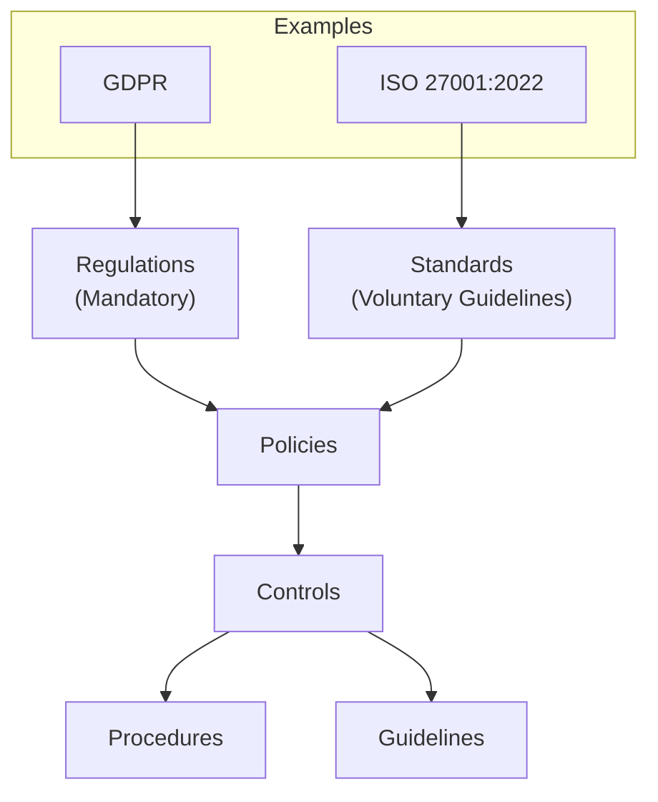
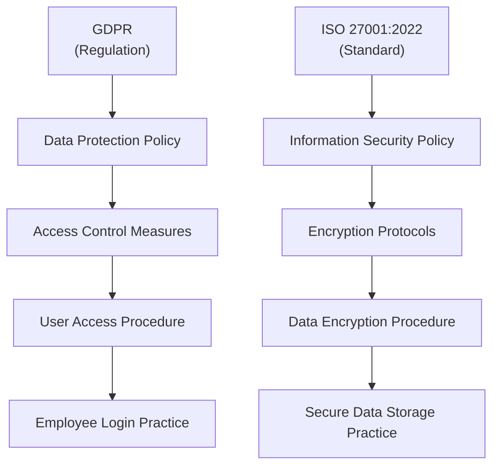

ISACA: ?

## **Different levels of compliance:**
- standard
- policy
- recommendation
- guideline

**Explanation**:

- **Regulations**: Legally enforceable requirements set by governmental bodies (e.g., GDPR).​
- **Standards**: Voluntary best practices developed by industry groups (e.g., ISO 27001:2022).​
- **Policies**: Organizational directives that align with applicable regulations and chosen standards.​
- **Controls**: Specific measures implemented to enforce policies.​
- **Procedures**: Detailed steps outlining how controls are executed.​
- **Practices**: Day-to-day activities ensuring procedures are followed effectively.

**Example:**

#### Standards
- **Definition**: Mandatory requirements and practices codified into specifications that organizations must follow.
- **Purpose**: Ensure consistency and compliance across the organization.

#### Policies
- **Definition**: High-level statements of management intent, outlining what should and shouldn't be done.
- **Components**:
    - **Management Review**: Policies should be periodically reviewed by management.
    - **Information Security Policy (ISP)**: Must be approved by senior management, documented, and communicated throughout the organization.

#### Procedures
- **Definition**: Documented steps to achieve policy objectives.
- **Purpose**: Provide detailed actions to ensure policies are implemented effectively.

#### Guidelines
- **Definition**: Recommendations for positive results, not mandatory.
- **Purpose**: Help make wise decisions and support best practices.

Comprehensive **security control processes** help in identifying and mitigating risks, ensuring compliance with regulations, and maintaining the integrity of financial and operational data.

When operating internationally, especially in regions like India and China, **policy controls** are critical. These regions have specific regulatory requirements and compliance standards that companies must adhere to.

Crossing the **risk threshold** means that the company is exposed to risks beyond its capacity to manage effectively. This can lead to operational disruptions, financial losses, and an inability to achieve strategic objectives

**Governance strategy** is the key component that ensures stakeholder needs, conditions, and options are evaluated to determine balanced enterprise objectives. It involves setting priorities, making decisions, and monitoring performance to align with governance direction

**Audit Charter**: Ask for a clear declaration about IS Auditor authority. 
- Which documentation should be available, 
- which IT processes should be verified or triggered: tests run, deployments, production logs...

**IS Audit plan**
1. Understand the organization’s mission, objective and purpose
2. Understand the organization’s governance structure
3. Review prior audit work papers
4. Perform a risk analysis
	1. ISO27001
	2. NIST80053
5. Set the audit **scope** and audit objectives
6. Develop the audit approach and strategy
7. Assign personnel to the audit
8. Address engagement logistics
	1. Can they enter the datacentre?
	2. How is data access guaranteed? It could be a new account made for the audit, a present person...

## E-commerce requirements
- persisted customer data is never exposed to the internet

**Electronic Data Interchange (EDI)** is a standardized method for exchanging business documents and data between organizations electronically, replacing traditional paper-based methods. EDI is widely used in various industries.
**Security Measures**: To protect the integrity, confidentiality, and availability of the data exchanged, EDI systems implement various security measures, including:
    - **Encryption**: Ensures that data is encrypted during transmission to prevent unauthorized access.
    - **Authentication**: Verifies the identity of the parties involved in the transaction to ensure that data is exchanged with trusted entities.
    - **Access Control**: Restricts access to EDI systems and data to authorized personnel only.

## Collecting evidence
- IS organization structure review
- IS policies review
- interviewing appropriate personnel
- Observation of processes
- Reperformance
- walk-through

### Computer assisted audit technologies (CAATs)
Data analytics tools to evaluate effectiveness of control environment and process improvements.
It should contain independent unbiased data to conduct automated tests and fraud detections.

### Exit interviews
- resolution recommendations with suggested implementation dates
- auditor reservation about policies and procedures not effective to fix controls

## **What is Governance?**

- **Definition**: Governance is the way an organization directs and controls its operations to meet strategic objectives.
- **Components**: Includes policies, procedures, controls, practices, and guidelines.
- **Ethical Issues and Decision-Making**: Governance ensures ethical practices and guides decision-making processes.

### **Enterprise Governance of IT (EGIT)**

- **Responsibility**: Managed by the board of directors and executive management.
- **Frameworks**: Commonly uses frameworks like COBIT 2019 to establish governance structures.
- **Key Elements**:
    - **IT Resource Management**: Efficient use of IT resources.
    - **Performance Measurement**: Evaluating how well IT functions perform.
    - **Compliance Management**: Ensuring adherence to regulatory requirements.

### **Governance vs. Management**

- **Governance**: Focuses on setting objectives, evaluating stakeholder needs, and aligning IT with business goals.
- **Management**: Involves planning, building, running, and monitoring activities in alignment with governance directions.

### **Purpose of EGIT**

- **Value Delivery**: Ensures IT delivers value to the business.
- **Risk Management**: Helps manage risks associated with IT and information systems.
#### **Information Security Governance (ISG)**

- **Responsibility**: Board of directors and CEO are accountable for ISG.
- **Alignment**: ISG must align with business objectives and comply with applicable laws and regulations.
- **Roles and Responsibilities**: Clear definition of roles, with senior management creating and approving security policies.
- **NIST**: ISG is a process of maintaining a framework that guarantees the security in information systems. 

### **Organizational Structure**

- **Decision-Making**: The structure of an organization determines who makes decisions and who provides advice. It influences how governance is implemented and how policies are enforced.
- **Types of Structures**:
    - **Hierarchical**: Traditional organizations with many layers of management. Often found in older companies.
    - **Flat**: Modern organizations, especially in tech, with fewer layers and more peer-based control.

#### **IT Governance Committees**

- **IT Strategy Committee**:
    
    - **Role**: Provides insight, advice, and guidance on IT development and alignment with business objectives.
    - **Responsibilities**:
        - Assessing the relevance of new IT developments.
        - Ensuring IT aligns with business direction.
        - Evaluating the availability of IT resources.
        - Considering the risks and competitive aspects of IT investments.

- **IT Steering Committee**:
    
    - **Role**: Makes decisions on IT spending and project approvals.
    - **Responsibilities**:
        - Deciding the level of IT spending.
        - Approving project plans and budgets.
        - Monitoring project progress and value delivery.
        - Communicating strategic goals to project teams.
        - Assisting executive management in delivering IT strategy.

Organizational structures play a crucial role in how effectively an organization can govern its IT operations. In hierarchical structures, decision-making is often slower due to multiple layers of approval, but it can provide clear lines of authority and accountability. In contrast, flat structures promote faster decision-making and greater flexibility, which is beneficial for innovation and rapid response to market changes.

## **Enterprise Architecture and Risk Management**

- **Enterprise Architecture**: Structured documentation of an organization's assets and their interactions.
- **Risk Appetite**: The maximum amount of risk an organization is willing to accept to maintain its capabilities.
- **Risk Threshold**: Occasional higher risk levels allowed for specific opportunities.
  Risk threshold refers to the point at which the level of risk becomes unacceptable, prompting the organization to take action to mitigate or manage the risk.
- **Risk Capacity**: The absolute limit of risk an organization can handle without severe consequences.

#### **Risk Management Process**

- **Identification**: Recognizing potential risks to organizational assets.
- **Analysis**: Evaluating the probability and impact of risks using qualitative, semi-quantitative, and quantitative methods.
- **Planning**: Developing strategies to respond to identified risks.
- **Response**: Implementing and monitoring risk responses.

#### **Levels of Risk Management**

- **Operational Level**: Day-to-day risks affecting routine operations.
- **Project Level**: Risks associated with specific projects or initiatives.
- **Strategic Level**: High-level risks impacting the overall direction and long-term goals of the organization.

#### **Cost-Effective Balance**

- **Control Implementations vs. Risk Acceptance**: Ensuring that the cost of risk mitigation measures is justified by the potential impact of the risks.

## Information Systems Maturity Models

#### **Purpose of Maturity Models**

- **Assessment**: Maturity models help assess the quality and effectiveness of an organization's information security processes.
- **Improvement**: They provide a framework for continuous improvement by identifying areas that need enhancement.

#### **Types of Maturity Models**
Maturity models like CMMI and IDEAL provide a structured approach to evaluating and improving organizational processes, helping identify areas for enhancement and promoting continuous improvement.

- **Capability Maturity Model Integration (CMMI)**: Developed by Carnegie Mellon and managed by **ISACA**, CMMI is widely used to evaluate and improve processes.
- **IDEAL Model**: Stands for Initiating, Diagnosing, Establishing, Acting, and Learning. It provides a structured approach to process improvement.

#### **CMMI Levels**
Also said: Initial, Repeatable, Defined, Managed, Optimizing
1. **Level 1 - Initial**: Processes are unpredictable and poorly controlled.
2. **Level 2 - Managed**: Basic project management processes are established.
3. **Level 3 - Defined**: Processes are well-documented and standardized.
4. **Level 4 - Quantitatively Managed**: Processes are measured and controlled.
5. **Level 5 - Optimizing**: Focus on continuous process improvement.

## Information Systems Governance, Risk, and Compliance (GRC)

#### **Governance**

- **Definition**: Governance involves setting policies, procedures, and controls to guide organizational operations.
- **Responsibility**: Senior management, board of directors, and executives are accountable for governance.
- **Components**: Includes internal audits, compliance programs, and operational risk management.

#### **Risk**

- **Definition**: Risk management identifies, analyzes, and responds to potential threats to organizational assets.
- **Process**: Involves risk identification, analysis, planning, and response.
- **Levels**: Operational, project, and strategic levels of risk management.

#### **Compliance**

- **Definition**: Compliance ensures adherence to laws, regulations, and standards.
- **Activities**: Includes monitoring, auditing, and enforcing policies and procedures.
- **Importance**: Compliance is crucial for maintaining legal and regulatory standards.

**Governance, Risk, and Compliance (GRC)** are three interconnected and overlapping activities essential for effective information systems management.

**Governance** sets the direction and control mechanisms for the organization, ensuring that policies and procedures are in place and followed. This includes internal audits to verify compliance and operational risk management to address potential threats.

**Risk management** is the process of identifying, analyzing, and responding to risks that could impact the organization's assets and operations. It operates at different levels, from day-to-day operational risks to strategic risks that affect long-term goals.

**Compliance** ensures that the organization adheres to relevant laws, regulations, and standards. This involves continuous monitoring and auditing to enforce policies and procedures, ensuring that the organization remains within legal and regulatory boundaries.

**Quality Assurance (QA)** is concerned with the processes and methodologies used to prevent defects in the development of information systems. Quality Control (QC), on the other hand, involves the identification and correction of defects in the final product.

Effective **cloud governance** involves ensuring compliance with regulatory requirements, establishing clear policies for cloud usage, and implementing robust access control mechanisms to protect data and resources.

Managing **third-party services** requires clear contractual obligations to define expectations and responsibilities, governance to oversee the relationship and ensure alignment with organizational goals, and internal audit reports to monitor performance and compliance.

**Financial auditing** in information systems involves ensuring compliance with accounting standards and implementing chargeback models to allocate costs appropriately within the organization.

Effective **human resource management** in information systems auditing includes policies and procedures for recruiting qualified personnel, providing ongoing training, managing hiring processes, and handling termination when necessary.

**Which of the following are key components of executing and monitoring in project management?**
- Information radiators, 
- Work performance data, 
- Scope management,
These components are essential for tracking progress, managing scope, and ensuring that the project stays on schedule. Information radiators provide visual updates, work performance data tracks progress, scope management ensures the project stays within defined boundaries, the work breakdown structure organizes tasks, and the critical path method identifies the sequence of crucial tasks.

A **feasibility study** assesses the viability of a project by analyzing potential risks, ensuring compliance with regulatory requirements, and managing stakeholder expectations. These components help determine whether the project is practical and worth pursuing.

**Fourth Generation Languages (4GL)** are designed to be more user-friendly and efficient for system development. Workbench concepts enhance their utility by providing integrated development environments that streamline coding, testing, and deployment processes.
EG: SAS, SQL, ABAP, MATLAB

## Decision support system
1. **Efficiency and Speed**: By automating data collection and analysis, DSS increase the speed and efficiency of decision-making processes
2. **Risk Management**: DSS help in identifying, assessing, and mitigating risks by providing comprehensive data analysis and predictive modeling
3. **Resource Optimization**: They assist in optimizing the use of resources by analyzing various scenarios and their potential outcomes
4. **Strategic Planning**: DSS support long-term strategic planning by providing insights into trends, patterns, and future projections

**Well-Known Examples of DSS**
1. **IBM Watson**: An AI-powered DSS that helps in various fields, including healthcare, finance, and customer service. Watson analyzes vast amounts of data to provide insights and recommendations, enhancing decision-making processes.
2. **SAP BusinessObjects**: A suite of business intelligence tools that provide comprehensive data analysis, reporting, and visualization capabilities. It helps organizations make data-driven decisions by offering insights into business operations and performance.

Proper organizational change management is crucial to address DSS implementation challenges.
Ensuring data consistency is important but not the most significant challenge in implementing DSS.

## Organization structures
### **Projectized Organization**

- **Structure**: Organized entirely around projects. Teams are formed specifically for projects and disbanded after completion.
- **Authority**: Project managers have full authority over the project and its resources.
### **Functional Organization**

- **Structure**: Divided into departments based on functions such as IT, finance, marketing, etc.
- **Authority**: Functional managers have the highest authority. Project managers have limited or no authority.
### **Matrix Organization**

- **Structure**: A blend of functional and projectized structures. Employees report to both functional and project managers.
- **Authority**: Shared between functional and project managers. The balance of power can vary:
    - **Strong Matrix**: Project manager has more authority.
    - **Weak Matrix**: Functional manager has more authority.
    - **Balanced Matrix**: Authority is shared equally.

## **Testing Methodologies**

#### **1. Importance of Testing**

**Role of Auditors**: Verify that appropriate testing is conducted as part of control measures.

#### **2. Types of Testing**

- **Unit Testing**: Tests individual pieces of code during development (e.g., during sprints in a Scrum environment).
- **Integration Testing**: Ensures that combined code from different developers works together without issues.
- **System Testing**: Tests the entire system as a whole to ensure it functions correctly.
- **Quality Assurance Testing (QAT)**: Verifies that all requirements are met before final acceptance.
- **User Acceptance Testing (UAT)**: Ensures that the system meets user expectations and requirements.

#### **3. Testing Classifications**

- **White Box Testing**: Involves understanding the internal logic of the software and testing its procedural accuracy.
- **Black Box Testing**: Focuses on the functional effectiveness of the system without considering its internal structure.
- **Regression Testing**: Re-runs tests to ensure that changes or corrections have not introduced new errors.
- **Alpha and Beta Testing**:
    - **Alpha**: Conducted by internal users to identify initial issues.
    - **Beta**: Conducted by a limited number of external users to identify any remaining issues before final release.
- **Parallel Testing**: Compares the performance of a new system with the original system to ensure consistency and meet user requirements.

#### **4. Testing Approaches**

- **Bottom-Up Testing**: Starts with small unit tests and progresses to larger system tests.
- **Top-Down Testing**: Begins with large system tests and works down to smaller unit tests.

#### **5. Post-Testing Activities**

- **Reporting**: Test results should be reported to relevant stakeholders (e.g., project managers).
- **Issue Resolution**: Address any issues identified during testing to ensure the final product meets quality standards.

## **Changeover Techniques**

#### **1. Importance of Changeover**

- **Purpose**: Transitioning users from one system or application to another, ensuring minimal disruption and maintaining data integrity.
- **Planning**: Changeover must be planned and monitored to avoid loss of productivity and data compliance issues (e.g., GDPR, HIPAA).

#### **2. Types of Changeover Techniques**

- **Parallel Changeover**:
    - **Description**: Both old and new systems run simultaneously. Users can access both until they are comfortable with the new system.
    - **Advantages**: Reduces risk by allowing fallback to the old system if issues arise.
    - **Disadvantages**: Resource-intensive, requiring support and payment for both systems.
- **Phased Changeover**:
    - **Description**: The old system is replaced module by module. Each module is tested and users are transitioned gradually.
    - **Advantages**: Reduces risk by allowing gradual transition and testing of each module.
    - **Disadvantages**: Extends project duration and can disrupt change management due to overlapping old and new modules.
- **Abrupt Changeover**:
    - **Description**: The new system is brought online and all users are migrated at once, often within a short period (e.g., 24-48 hours).
    - **Advantages**: Quick transition, useful when immediate change is necessary (e.g., ending licensing agreements).
    - **Disadvantages**: High risk of data integrity issues, missing records, and asset safeguarding concerns.

## IT Asset Management
An asset is anything tangible or intangible the company uses to create a product or a service.
- Capability
- Resource
Assets have to be identified in an **inventory** first in order to be protected.
### Main backend devices:
- Supercomputers
- mainframes
- high range servers
- desktop/laptop endpoint devices
- thin clients

### USB/RFID
Risks
- theft of data / badge skimmers
- malware injection
- data corruptions
Controls
- data encryption
- locked desktop
- Personnel training

## Data Governance
- Data Quality and Lifecycle
- Operating systems
- Source code management
- Incident management

### Data Quality
- Intrinsic
	- Accuracy (reliable)
	- Objectivity
	- Believability
	- Reputation
- Contextual
	- Currency
	- Interpretability
	- Relevancy
	- Completeness
	- Amount
- Security/accessibility
	- availability
	- restricted access (confidentiality)

---

### 📁 Data Lifecycle

The data lifecycle encompasses the stages through which data progresses within an organization:​

1. **Plan**: Establish data governance policies, define data requirements, and plan for data acquisition.​
    
2. **Design**: Develop data models, structures, and storage solutions aligning with business objectives.​
    
3. **Build**: Implement data systems, ensuring integration with existing infrastructure and adherence to security protocols.​
    
4. **Use**: Access and utilize data for operational and analytical purposes, maintaining data quality and integrity.
    
5. **Monitor**: Continuously oversee data usage, performance, and compliance with policies.​[CISA](https://www.cisa.gov/resources-tools/training/incident-management-review-imr-training?utm_source=chatgpt.com)
    
6. **Dispose**: Securely delete or archive data that is no longer needed, in accordance with retention policies.​
    

​[ISACA ExamTopics](https://www.examtopics.com/discussions/isaca/view/146334-exam-cisa-topic-1-question-1354-discussion)

---

### 🚨 Incident Management

Effective incident management involves a structured approach:

1. **Identification**: Detect and acknowledge potential security incidents through monitoring and reporting mechanisms.​
    
2. **Categorization**: Classify incidents based on severity, impact, and type to prioritize response efforts.​
    
3. **Resolution**: Implement appropriate measures to contain, eradicate, and recover from the incident, followed by post-incident analysis.

CISA professionals must evaluate an organization's incident management processes, ensuring they are robust, well-documented, and capable of effectively handling security events.​

---

### 📦 Release and Patch Management

This area focuses on the systematic deployment of software updates:​

- **Release Management**: Oversee the planning, scheduling, and control of software builds through different stages and environments.​
    
- **Patch Management**: Identify, acquire, test, and install patches to fix vulnerabilities and improve system functionality.​
    

For CISA certification, auditors must assess whether organizations have effective release and patch management policies that minimize risks associated with software vulnerabilities.​

---

### 📊 Business Impact Analysis (BIA)

BIA is a process that helps organizations:​ 
- Identify critical business functions and the resources that support them.​[Infosec Institute](https://www.infosecinstitute.com/resources/cisa/cisa-domain-4-information-systems-operations-maintenance-and-service-management/?utm_source=chatgpt.com)
- Evaluate the potential impact of disruptions on these functions.​    
- Determine recovery priorities and strategies.
  ​[CISA ISACA BIA](https://www.cisa.gov/resources-tools/services/business-impact-analysis-bia-system-security)

CISA candidates should understand how to assess the adequacy of BIA processes, ensuring they effectively inform disaster recovery and business continuity planning.​

---

### 🔄 System Resiliency

System resiliency refers to the ability of an information system to withstand and recover from disruptions. Key concepts include:​

- **Recovery Point Objective (RPO)**: The maximum tolerable period in which data might be lost due to a major incident.​
    
- **Recovery Time Objective (RTO)**: The targeted duration of time within which a business process must be restored after a disruption.​
    
- **Active-Passive Configuration**: A setup where the secondary system remains idle until the primary system fails.​
    
- **Active-Active Configuration**: Both systems run concurrently, providing load balancing and high availability.​
    

## 🧩 'Information Systems Operations and Business Resiliency'

**General Overview:** Information Systems Operations and Business Resiliency encompass the strategies and practices that ensure IT systems support business objectives and can withstand disruptions. This includes robust infrastructure, effective incident response, and continuous improvement processes.​

**CISA Relevance:** CISA professionals evaluate the alignment of IT operations with business resiliency goals, ensuring that systems are reliable, secure, and capable of supporting critical functions during adverse events.​

**Resource:** [Information Systems Operations and Business Resiliency - ACI Learning](https://www.acilearning.com/catalog/it/information-systems-operations-and-business-resiliency/)​

### 🔄 Backups, Storage, and Restoration

**General Overview:** Effective backup strategies are crucial for data integrity and business continuity. Implementing the 3-2-1 backup rule—maintaining three copies of data, on two different media, with one off-site—ensures resilience against data loss. Regular testing of backups is essential to confirm data can be restored when needed.​

- Full
- Incremental
- Differential
- Rotation of media

**Resource:** [Backup & Recovery Trends 2025 - Unitrends](https://www.unitrends.com/blog/backup-and-recovery-trends-2025/)​[Unitrends+1Unitrends+1](https://www.unitrends.com/blog/backup-and-recovery-trends-2025/?utm_source=chatgpt.com)

---

### 🛡️ Business Continuity Management (BCM)

**General Overview:** Business Continuity Management (BCM) involves preparing for potential disruptions to maintain critical business functions. It encompasses risk assessments, business impact analyses, and the development of strategies to ensure operational resilience.​

Disasters could be:
- local
- regional
- global
- Due to human error or malicious entities (terrorism, malware, hackers)

**Resource:** [2025 Trends in Continuity and Resilience - Fusion Risk Management](https://www.fusionrm.com/blogs/2025-trends-in-continuity-and-resilience/)​[fusionrm.com](https://www.fusionrm.com/blogs/2025-trends-in-continuity-and-resilience/?utm_source=chatgpt.com)

---

### 📋 The Business Continuity Plan (BCP)

**General Overview:** A Business Continuity Plan (BCP) outlines procedures and resources required to maintain business operations during unforeseen events. It includes identifying critical functions, assigning responsibilities, and establishing communication protocols.​

- BCP starts with risk assessment
- Needs Inventory of Critical operations, human and material resources needed (BIA)
- Needs a metrics to be monitored to define what is a "major incident"

**Resource:** [20 Essential Elements Of A Robust Business Continuity Plan - Forbes](https://www.forbes.com/councils/forbestechcouncil/2025/01/09/20-essential-elements-of-a-robust-business-continuity-plan/)

---

### 🧪 Testing the BCP

**General Overview:** Regular testing of the BCP is vital to validate its effectiveness. Testing methods include tabletop exercises, simulations, and full-scale drills, which help identify gaps and areas for improvement.​

- pre-test
- test
- post-test: report time and resources consumed, missed steps from the plan...

**Resource:** [6 Business Continuity Plan Testing Best Practices - Noggin](https://www.noggin.io/blog/6-business-continuity-plan-testing-best-practices)​

---

### 🌪️ Disaster Recovery Plans (DRP)

**General Overview:** Disaster Recovery Plans (DRPs) focus on restoring IT systems and data after a disruption. Key components include defining Recovery Time Objectives (RTOs), Recovery Point Objectives (RPOs), and establishing recovery procedures.​

**RTO** is the maximum tolerable duration of any outage.
**RPO** is the maximum acceptable amount of data loss measured in time.

**Resource:** [How to Write a Disaster Recovery Plan in 2025: Template + Examples - Secureframe](https://secureframe.com/blog/disaster-recovery-plan)

---

### 🧪 Testing the DRP

**General Overview:** Testing the DRP involves simulating disaster scenarios to evaluate the effectiveness of recovery procedures. Regular testing helps identify weaknesses and ensures that recovery objectives can be met.​

​[libertycenterone.com+2LinkedIn+2Duplicacy Forum+2](https://www.linkedin.com/pulse/world-backup-day-2025-modern-data-strategies-secure-future-benis-tyeye)

**Resource:** [Disaster Recovery Testing: What It Is, How It Works and Where To Start - Warren Averett](https://warrenaverett.com/insights/disaster-recovery-testing/)​

---

## 🛡️ Protection of Information Assets

### Frameworks, Roles, and Data Protection

Protecting information assets involves implementing structured frameworks that define roles, responsibilities, and data protection measures. The NIST Cybersecurity Framework (CSF) is widely adopted, comprising five core functions: Identify, Protect, Detect, Respond, and Recover. These functions guide organizations in managing and reducing cybersecurity risks.​[Wikipedia](https://en.wikipedia.org/wiki/NIST_Cybersecurity_Framework?utm_source=chatgpt.com)

**Roles and responsibilities** are delineated within these frameworks to ensure accountability and effective implementation of security measures.​

**Data protection** strategies include:​

- **Data Classification**: Categorizing data based on sensitivity to apply appropriate security controls.  ​
 - **Encryption**: Protecting data confidentiality during storage and transmission.​  
- **Regular Audits**: Assessing compliance with data protection policies and identifying potential vulnerabilities.​  

**Data privacy**:  foundational guidelines that govern the collection, processing, and storage of personal data. Key principles include:​
	- **Lawfulness, Fairness, and Transparency**: Data must be processed legally, fairly, and transparently to the individual. 
	  ​[Homepage | Data Protection Commission](https://www.dataprotection.ie/en/individuals/data-protection-basics/principles-data-protection)  
	- **Purpose Limitation**: Data should be collected for specified, explicit, and legitimate purposes and not further processed in a manner incompatible with those purposes.​
	  [Data Protection Principles](https://www.dataprotection.ie/en/individuals/data-protection-basics/principles-data-protection)  	    
	- **Data Minimization**: Only data that is necessary for the intended purpose should be collected.​  
	- **Integrity and Confidentiality**: Data must be processed securely to prevent unauthorized access, loss, or damage.​

**Access Controls**: Ensuring only authorized individuals can access specific data.​
  [Investopedia](https://www.investopedia.com/terms/e/encryption.asp?utm_source=chatgpt.com)  

**Physical access** controls are security measures designed to prevent unauthorized physical access to facilities, equipment, and resources. Key components include:​  
	- **Access Control Systems**: Utilizing key cards, biometric scanners, or PIN codes to restrict entry to authorized personnel.​  
	- **Surveillance Systems**: Implementing CCTV cameras to monitor and record activities in sensitive areas.​  
	- **Security Personnel**: Employing trained security staff to oversee access points and respond to incidents.​  
	- **Visitor Management**: Maintaining logs of visitors, issuing temporary badges, and escorting them within the premises.​    
	- **Regular Audits**: Conducting periodic reviews of access logs and physical security measures to ensure effectiveness.  

https://www.idmanagement.gov/university/pacs/

**Environmental Controls**: 
	- **Fire Suppression Systems**: Installing fire alarms and suppression systems to detect and extinguish fires promptly.​    
	- **Climate Control**: Maintaining optimal temperature and humidity levels to prevent equipment overheating or condensation.​      
	- **Uninterruptible Power Supplies (UPS)**: Providing backup power to maintain operations during outages.​      
	- **Water Leak Detection**: Implementing sensors to detect and alert for water leaks that could damage equipment.​      
	- **Seismic Protection**: Designing facilities to withstand earthquakes, including securing equipment to prevent tipping.  

For a comprehensive understanding of the NIST CSF, refer to the [NIST Cybersecurity Framework](https://en.wikipedia.org/wiki/NIST_Cybersecurity_Framework).​

### IT Security baseline:
- password policy
- automated patch management
- Asset inventory
- Addressing vulnerabilities
- Backups: present and tested

---

### 📦 Asset Management and Logging

Effective asset management and logging are critical for maintaining security and facilitating incident response.​

#### Asset Management

Asset management involves maintaining an up-to-date inventory of all hardware, software, and data assets. This practice ensures that security measures can be appropriately applied and that assets are accounted for during risk assessments.​

#### Logging

Logging entails recording events and activities within information systems to monitor operations and detect anomalies. Key aspects include:​

- **Comprehensive Log Collection**: Capturing logs from various sources such as operating systems, applications, and network devices.​
    
- **Log Management Policies**: Establishing procedures for log retention, analysis, and disposal.​
    
- **Security Information and Event Management (SIEM)**: Utilizing tools to aggregate and analyze log data for real-time threat detection.​
    

For guidance on audit log management, consult [CIS Control 8: Audit Log Management](https://blog.netwrix.com/2022/06/16/audit-log-management/).​

---

### 🌐 Network Security, Cloud Computing, and Cryptography

#### Network Security

Network security encompasses measures to protect the integrity, confidentiality, and availability of data during transmission. Key components include:​

- **Firewalls**: Controlling incoming and outgoing network traffic based on predetermined security rules.​
    
- **Intrusion Detection and Prevention Systems (IDPS)**: Monitoring networks for malicious activities and policy violations.​
    
- **Virtual Private Networks (VPNs)**: Establishing secure connections over public networks.​
    

#### Cloud Computing

The adoption of cloud computing introduces unique security challenges, such as data breaches and misconfigurations. To mitigate these risks:​[Financial Times](https://www.ft.com/content/2b36a642-bda5-4e43-9747-2175c4d72fd0?utm_source=chatgpt.com)

- **Data Encryption**: Encrypting data both at rest and in transit.​
    
- **Access Management**: Implementing strict access controls and multi-factor authentication.​
    
- **Regular Audits**: Assessing cloud service providers' security practices and compliance.​
    

For insights into cloud security risks, refer to [Banks moving into the cloud prompt forecasts of security risk](https://www.ft.com/content/2b36a642-bda5-4e43-9747-2175c4d72fd0).​

#### Cryptography

Cryptography is essential for securing data through encryption and ensuring secure communication. There are two primary types:​ 

- **Symmetric Encryption**: Uses the same key for encryption and decryption.​  
- **Asymmetric Encryption**: Utilizes a pair of keys—a public key for encryption and a private key for decryption.​

As quantum computing advances, traditional encryption methods face potential vulnerabilities. Organizations are exploring post-quantum cryptography to address these emerging threats. ​

For a detailed explanation of encryption, see [What Is Encryption? How It Works, Types, and Benefits](https://www.investopedia.com/terms/e/encryption.asp).​

---

### 🧪 Security Testing, Incident Management, and Forensics

#### Security Testing

Regular security testing is vital to identify and remediate vulnerabilities. Common testing methods include:​

- **Vulnerability Scanning**: Automated tools to detect known vulnerabilities.​      
- **Penetration Testing**: Simulated attacks to evaluate system defenses.​      
- **Security Audits**: Comprehensive reviews of security policies and controls.​

#### Incident Management

Incident management involves preparing for, detecting, responding to, and recovering from security incidents. Key steps include:​

- **Preparation**: Establishing incident response plans and teams.​   
- **Detection and Analysis**: Identifying incidents and assessing their impact.​      
- **Containment, Eradication, and Recovery**: Isolating affected systems, removing threats, and restoring operations.​  
- **Post-Incident Activity**: Analyzing incidents to improve future responses.​  

### Forensics

Digital forensics involves collecting and analyzing electronic evidence to investigate incidents. This process supports legal proceedings and helps organizations understand breaches to prevent recurrence.

---
## 🔐 Infosec Network Infrastructure
![[firewall-infra.png]]

### 🛡️ Network Infrastructure Security & Firewalls

Network infrastructure security involves safeguarding the hardware and software resources that facilitate network connectivity, communication, operations, and management. Firewalls are critical components that monitor and control incoming and outgoing network traffic based on predetermined security rules. They act as barriers between trusted internal networks and untrusted external networks, such as the internet.
​[Red Hat - cloud-vs-virtualization](https://www.redhat.com/en/topics/cloud-computing/cloud-vs-virtualization)

**Key Concepts:**

- **Firewalls:** Devices or software that enforce security policies by filtering traffic.​
  [CISA - securing-network-infrastructure-devices](https://www.cisa.gov/news-events/news/securing-network-infrastructure-devices)   
- **Segmentation:** Dividing a network into segments to control traffic flow and limit access. 
  [firewall-security](https://www.f5.com/glossary/firewall-security)      
- **Access Control Lists (ACLs):** Rules that permit or deny traffic based on various criteria.​

**Resource:** [VMware: Network Infrastructure Security](https://www.vmware.com/topics/network-infrastructure-security)

---

### 🔄 Change Management in Networks

Change management is a systematic approach to dealing with alterations in network infrastructure. It ensures that changes are made with minimal disruption to services and includes planning, testing, and implementing changes while maintaining security and compliance.​[vivantio.com - what-is-change-management-in-cyber-security](https://www.vivantio.com/blog/what-is-change-management-in-cyber-security)

**Key Concepts:**  
- **Risk Assessment:** Evaluating potential impacts of changes.​      
- **Documentation:** Keeping detailed records of changes for accountability.​      
- **Approval Processes:** Ensuring changes are reviewed and authorized before implementation.​  [itsecurityguru.org - effective-change-management-practices](https://www.itsecurityguru.org/2024/07/29/effective-change-management-practices-in-it-environments-a-guide)    

**Resource:** [TechTarget: 5 Principles of Network Change Management](https://www.techtarget.com/searchnetworking/tip/5-principles-of-the-network-change-management-process)

---

### 🔐 Encryption Systems

Encryption is the process of converting data into a coded format to prevent unauthorized access. It is fundamental to protecting sensitive information both at rest and in transit.​[TechTarget - Encryption](https://www.techtarget.com/searchsecurity/definition/encryption)

**Key Concepts:**  
- **Symmetric Encryption:** Uses the same key for encryption and decryption.​[safebase.io](https://safebase.io/blog/the-role-of-encryption-in-information-security-how-encryption-protects-sensitive-data?utm_source=chatgpt.com)      
- **Asymmetric Encryption:** Uses a pair of keys (public and private) for encryption and decryption.​  
- **End-to-End Encryption (E2EE):** Ensures that data is encrypted on the sender's system and only decrypted on the recipient's system.​      

**Resource:** [Google Cloud: What is Encryption?](https://cloud.google.com/learn/what-is-encryption)​

---

#### 🔐 Applications of Cryptography

Cryptography is used to secure communication and protect information from adversaries. Its applications are vast and integral to information security.
​[TutorialsPoint applications-of-cryptography-in-information-security](https://www.tutorialspoint.com/what-are-the-applications-of-cryptography-in-information-security)

**Key Applications:**

- **Secure Communications:** Protecting data during transmission.​      
- **Authentication:** Verifying the identity of users and devices.​      
- **Data Integrity:** Ensuring that information has not been altered.

**Resource:** [IBM: Cryptography Use Cases](https://www.ibm.com/think/topics/cryptography-use-cases)

---

### 🔑 The Public Key Infrastructure (PKI)

PKI is a framework that enables secure, encrypted communication and authentication over networks. It uses a pair of cryptographic keys and digital certificates issued by a Certificate Authority (CA).​
[Keyfactor - PKI](https://www.keyfactor.com/education-center/what-is-pki)

**Key Components:**  
- **Certificate Authority (CA):** Trusted entity that issues digital certificates.​[GeeksforGeeks](https://www.geeksforgeeks.org/public-key-infrastructure)  
- **Registration Authority (RA):** Verifies the identity of entities requesting certificates.      
- **Digital Certificates:** Electronic documents that use a digital signature to bind a public key with an identity.​

**Resource:** [Okta: What is Public Key Infrastructure?](https://www.okta.com/identity-101/public-key-infrastructure/)​

---

### 📋 IS Audits and Social Media

Information Systems (IS) audits assess the controls and security of an organization's information systems. With the rise of social media, audits now also encompass the evaluation of social media policies, usage, and associated risks.​

One of the largest attack vectors into organizations.

**Key Considerations:**  
- **Policy Compliance:** Ensuring social media use aligns with organizational policies.​  
- **Risk Management:** Identifying and mitigating risks such as data leaks and reputational damage.​  
- **Monitoring:** Regularly reviewing social media activity for unauthorized or inappropriate content.​  

**Resource:** [AuditBoard: Auditing Social Media](https://www.auditboard.com/blog/auditing-social-media-5-areas-concern/)​

---

### ☁️ Virtualization and Cloud Computing

Virtualization and cloud computing have transformed IT infrastructure, offering scalability and flexibility. However, they also introduce new security challenges that must be addressed.​

**Key Security Aspects:**

- **Hypervisor Security:** Protecting the software layer that enables virtualization.​      
- **Isolation:** Ensuring that virtual machines (VMs) are isolated to prevent cross-contamination.​[cloud-and-virtualization-security](https://cloudnetworks.ae/solutions/cloud-and-virtualization-security)  
- **Access Control:** Managing who has access to virtual environments and cloud resources.​  

**Resource:** [Red Hat: Virtualization vs Cloud Computing](https://www.redhat.com/en/topics/cloud-computing/cloud-vs-virtualization)

